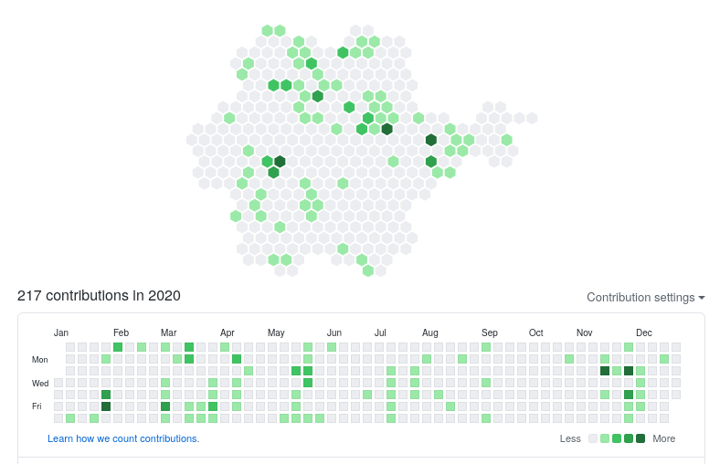

# time\_filling

Idea: a week is 7 days, and a group of 7 hexagons just happens to form a bigger hexagon. What if we were to represent the rectangular commit graph, as hexagons ?

The project is called time\_filling as a reference to space filling curves such as the Hilbert curve.

The actual code which is written in Rust, and the actual build instructions are in [mk3/](mk3/README). The rest is old attempts that weren't documented well enough, so I just gave up

The conclusion is that hexagons are pretty, but it's less readable than the normal square grid.

All of this code is available under the [MIT License](LICENSE).

Here's the old README for the C++ code:

---

## Requirements
For the library:
* C++17
* cmake 1.11 or something

For `display.py`:
* python with matplotlib and the GTK3Cairo backend (or whichever you get to work)

## Building

Set `g++-8` or any C++17 compiler as your `CXX` environmnet variable,
then run `cmake` in your `$BUILDROOT`

To view the path, you can currently use
    $BUILDROOT/Cli/tfill | python $REPO/display.py
